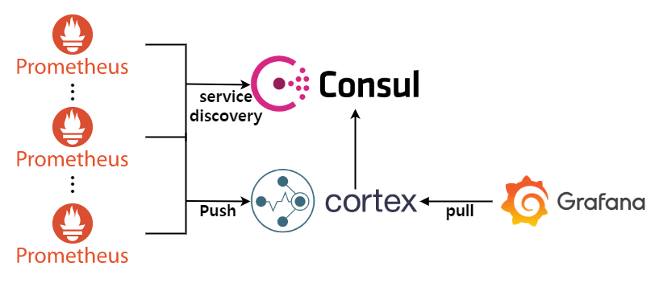

# hello-world-cortex
Cortex는 Prometheus를 위해 horizontally scalable, high available, multi-tenant, long term storage를 제공한다.

- **Horizontally scalable**: Cortex는 클러스터 내부 여러 machine에서 동작할 수 있으며, 단일 시스템에서의 처리량 및 storage의 한계를 뛰어넘을 수 있다. 이를 통해 여러 Prometheus 서버의 metric을 단일 Cortex 클러스터에 저장할 수 있으며 모든 데이터에 대해 "globally aggregated" 쿼리를 실행할 수 있다.
- **Highly available**: 클러스터에서 동작할 때 Cortex는 machine 간에 데이터를 복제할 수 있다. 이를 통해 일부 machine에 장애가 발생할 경우에도 데이터에 대한 공백을 없앨 수 있다.
- **Multi-tenant**: Cortex는 단일 클러스터 내에서 서로 다른 여러 독립적인 Prometheus의 데이터와 쿼리를 격리할 수 있기 때문에 신뢰할 수 없는 제 3자와 동일한 클러스터를 공유할 수 있다.
- **Long term storage**: Cortex는 metric 데이터를 위한 S3, GCS, Microsoft Azure, Cassandra와 같은 long term storage를 지원한다. 이를 통해 단일 시스템에서의 수명보다 오래 데이터를 저장할 수 있다.

Prometheus와 관련된 기초는 [hello-world-prometheus](https://github.com/pyo-counting/hello-world-prometheus) 프로젝트를 참고한다.

## 1. Architecture overview
이 프로젝트는 여러 노드로 구성된 Docker swarm 클러스터에서 동작한다. 단일 노드에서 배포할 경우 Cortex를 실행하는 방법은 [Getting started with chunks storage](https://cortexmetrics.io/docs/chunks-storage/getting-started-chunks-storage/) 페이지를 참고한다.


- 위 그림에서는 실제 metric 수집을 담당하는 Node Exporter, Cadvisor에 대한 구성을 생략했다. 
- Cassandra의 경우 Cortex 내부 구성요소로 판단해 위 그림에서 생략했다. Cortex의 상세 구조는 [Archituecture](https://cortexmetrics.io/docs/architecture/) 페이지를 참고한다.

### 1.1 Consideration
- Consul
  - Consul은 Prometheus의 service discovery, Cortex각 구성 요소의 key-value store 역할을 한다. 사용자 환경에 맞게 Consul 외에 다른 프로젝트를 사용해도 무방하다.
- Prometheus
  - scrape_configs 내 모든 job이 공통적으로 Consul service discovery를 사용하며, Consul service에 등록된 metadata를 label로 relabelling한다. 추가 label이 필요할 경우 Consul의 service에 등록 및 scrape_configs 내 설정을 진행하면 된다.
- Docker
  - 프로젝트에서 사용한 docker config 중 중요 정보가 포함될 경우 docker secret을 사용하면 된다.

### 1.2 Limitation
- Cadvisor
- Node Exporter
  - 두 exporter의 경우 Docker swarm에 배포 시 몇 가지 제한 사항이 있어 sidecar docker container를 실행 및 해당 container에서 다시 Cadvisor, Node Exporter standalone container를 실행하도록 구성했다([running sidecar container](https://github.com/google/cadvisor/issues/2150#issuecomment-797788353)). Cadvisor의 경우 일부 기능을 위해 호스트의 /dev 디렉토리에 접근해야 하지만 docker swarm 환경에서 이를 지원하지 않으며 Node Exporter의 경우 일부 기능을 위해 호스트의 PID namepsace를 사용해야 하지만 이 기능이 제한된다. 이러한 구조를 원치 않을 경우 따로 각 모니터링 대상 호스트에 Cadvisor, Node Exporter를 standalone container 환경에서 실행하도록 구성해도 무방하다.
- Consul
  - 해당 프로젝트에서는 단일 인스턴스로 실행하기 위해 -dev flag를 사용해 Consul을 실행한다. Consul에 새 service discovery 항목을 등록할 때 docker config를 변경할 경우, service 자체가 다시 배포되기 때문에 HA 구성이 필요하다. Consul에서 service discovery 등록 [HTTP API](https://learn.hashicorp.com/tutorials/consul/get-started-service-discovery?in=consul/getting-started#http-api)를 제공하기 때문에 이를 사용해도 된다.
- Prometheus
  - Prometheus는 설정 파일 내 환경변수 확장을 지원하지 않아 env.* 파일이 아닌 직접 prometheus.yml 파일을 수정해야 한다([--enable-feature=expand-external-labels](https://prometheus.io/docs/prometheus/latest/feature_flags/#expand-environment-variables-in-external-labels) experimental flag를 지원하지만 external_labels 값에 대해서만 지원한다).
- Cortex
  - ingester의 데이터 손실을 방지하기 위해 replication factor를 활성화했지만, wal(write ahead log)은 아래 제한으로 비활성화 했다. wal은 데이터 저장을 위해 파일 시스템 내 저장이 필요하다. Docker container 환경에서는 container가 종료되더라도 파일 시스템의 데이터 영속성(persistancy)을 위해 volme을 사용해야 한다. 즉, 여러 노드에서 실행되는 ingester 구성요소에 대해 동일한 volume을 제공해야 하는 제한이 있다.
- Docker
  - docker stack deploy 명렁어의 경우 compose 파일 내 대한 환경 변수 확장을 지원하지 않아 보통 아래와 같이 사용한다.
   ```bash
   docker stack deploy -c <(docker-compose -f <COMPOSE_FILE> config) <STACK_NAME>
   ```
  하지만 [Docker Engine 20.10.13 release](https://docs.docker.com/engine/release-notes/#201013)부터 지원하는 docker compose 서브커맨드 플러그인을 이용할 경우 몇 가지 버그가 있어 대신 docker-compose를 사용했다.

## 2. Configuration
정상 설치 및 실행하기 위해 사용자 환경에 따라 기본적으로 변경되어야 하는 설정은 다음과 같다.
- docker-stack.yml
  - 각 service는 배포에 대한 제한이 있다(cortex_stack.\*.deployable label이 true인 node에만 배포된다. node.labels.cortex_stack.\*.deployable == true). 서비스가 배포될 노드에 label 설정이 필요하다([docker node update](https://docs.docker.com/engine/reference/commandline/node_update/)).
- env.(prd|dev)
  - docker-stack.yml 파일에서 사용되는 환경 변수 목록이다. 해당 파일에 설정된 환경 변수들은 docker swarm 환경에서 각 Loki 구성 요소에 대한 service 배포 시 실행된 replica 개수(LOKI_*_REPLICAS), container의 컴퓨팅 리소스 제한(\*\_RESOURCES_LIMITS\_\*) 등과 관련됐다. 실행 환경에 맞게 환경 변수 값 설정이 필요하다.
- grafana/env.(prd|dev)
  - grafana/grafana.ini, grafana/provisioning/datasources/* 파일에서 사용되는 환경 변수 목록이다. 실행 환경에 맞게 환경 변수 값 설정이 필요하다.
- grafana/cert/*
  - 인증서, 인증서 key 저장 디렉토리다. 실행 환경에 맞게 인증서 파일을 관리하면 된다.
- prometheus/env.(prd|dev)
  - prometheus/prometheus.yml 파일에서 사용되는 환경 변수 목록이다. 실행 환경에 맞게 환경 변수 값 설정이 필요하다.
- cortex/env.(prd|dev)
  - cortex/cortex.yml 파일에서 사용되는 환경 변수 목록이다. 실행 환경에 맞게 환경 변수 값 설정이 필요하다.

## 3. Installation
Cortex는 여러 클러스터링 환경에서 운영되며, 이를 위해 Docker swarm 환경에서 배포한다.

### 3.1 Execution environment info
해당 프로젝트는 아래 환경에서 정상 동작했음을 테스트했다.
- OS: CentOS Linux release 7.8.2003 (Core)
- Kernel version: 3.10.0-1127.18.2.el7.x86_64 #1 SMP Sun Jul 26 15:27:06 UTC 2020
- Docker version: 20.10.17
- Docker-compose version: 1.26.2

### 3.2 Software Version Info
- Prometheus: [v2.32.0](https://github.com/prometheus/prometheus/releases/tag/v2.32.0)
- Cadvisor: [v0.37.5](https://github.com/google/cadvisor/releases/tag/v0.37.5)
- Node-exporter: [v1.3.1](https://github.com/prometheus/node_exporter/releases/tag/v1.3.1)
- JMX-exporter: [0.16.1](https://github.com/prometheus/jmx_exporter/releases/tag/parent-0.16.1)
- Grafana: [8.3.3](https://github.com/grafana/grafana/releases/tag/v8.3.3)
- SpringBoot (maven dependency):
    - spring-boot-starter-parent: [2.3.1.RELEASE](https://github.com/spring-projects/spring-boot/releases/tag/v2.3.1.RELEASE)
    - micrometer-registry-prometheus: [1.8.2](https://github.com/micrometer-metrics/micrometer/releases/tag/v1.8.2)
- Cortex: [1.11.0](https://github.com/cortexproject/cortex/releases/tag/v1.11.0)
- Consul: [1.12.2](https://github.com/hashicorp/consul/releases/tag/v1.12.2)
- Cassandra: [4.0.4](https://github.com/apache/cassandra/releases/tag/cassandra-4.0.4)
    
### 3.3 Step by step
1. project clone하기
   ```bash
   git clone https://github.com/pyo-counting/hello-world-cortex.git
   ```
2. 프로젝트 디렉토리로 이동
   ```bash
   cd hello-world-cortex
   ```
3. docker service 배포 및 확인
   ```bash
   ./run.sh prd
   docker stack ps monitoring_stack
   ```
3. docker service down
   ```bash
   # service down
   docker stack rm monitoring_stack
   # remove volume
   docker volume rm $(docker volume ls --filter name=monitoring_stack --format {{.Name}})
   ```

## 4. Documentation
- [Prometheus](https://prometheus.io/docs/introduction/overview/)
- [Cadvisor](https://github.com/google/cadvisor)
- [Node-exporter](https://github.com/prometheus/node_exporter)
- [JMX-exporter](https://github.com/prometheus/jmx_exporter)
- [Grafana](https://grafana.com/docs/grafana/latest/)
- [SpringBoot](https://docs.spring.io/spring-boot/docs/current/reference/html/actuator.html)
- [Cortex](https://cortexmetrics.io/docs/)
- [Consul](https://www.consul.io/docs)
- [Cassandra](https://cassandra.apache.org/doc/latest/)

## 5. Etc
- Architecture overview은 [draw.io](https://www.draw.io)를 통해 작성
- [hello-world-prometheus](https://github.com/pyo-counting/hello-world-prometheus) 프로젝트의 Alertmanager는 Grafana의 알람 기능으로 대체할 예정이다.

## 6. Deprecated
- Prometheus의 file service discovery를 위한 ./prometheus/sd_configs 디렉토리 내 파일이 존재하지만 사용하지 않는다(consul sd 대체).